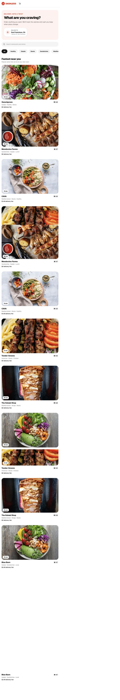

# DashLess

A playful food-delivery experience with a twist: place an order, follow your driver, receive the delivery notification, and discover how much money and how many calories you saved.



## Live demo

[Open DashLess](https://dashless-delivery.angelinaquan2024.chatgpt.site)

## Features

- Browser-based location detection with a graceful fallback
- Restaurant search and cuisine filters
- Restaurant menus, cart controls, and checkout
- Simulated driver tracking with a one-hour ETA
- Delivery notification and an instant demo fast-forward
- Personalized calories-and-money-saved reveal
- Responsive mobile and desktop layouts

## Built with

- React 19
- TypeScript
- Tailwind CSS
- Vinext and Vite
- shadcn/ui and Lucide icons

## Run locally

```bash
npm install
npm run dev
```

Then open [http://localhost:3000](http://localhost:3000).

## Disclaimer

DashLess is an independent concept project. It is not affiliated with or endorsed by DoorDash or any restaurant shown in the demo.
